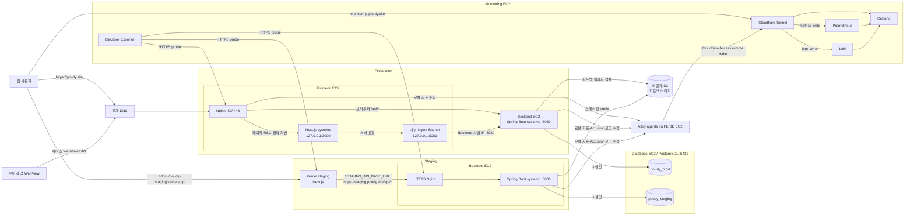
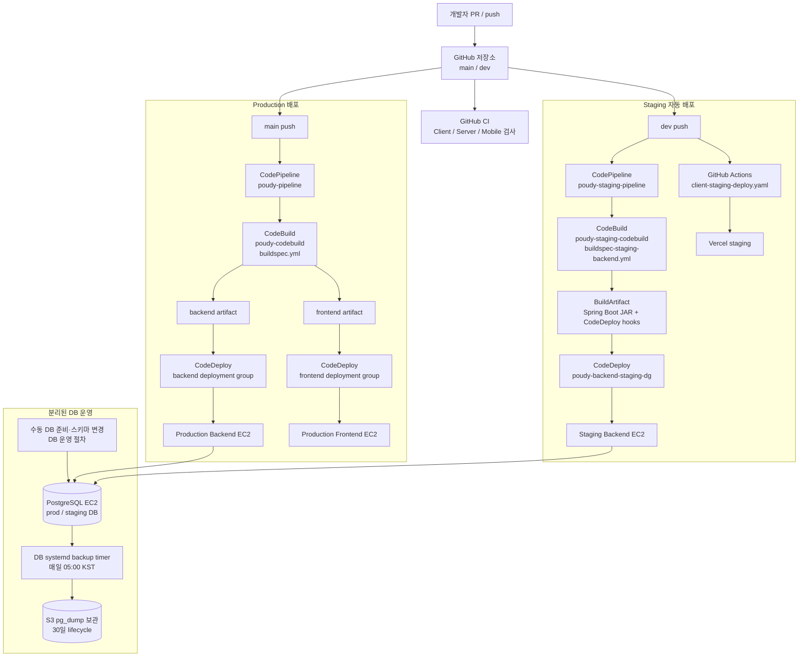

# Poudy 전체 서비스·배포 구조

이 문서는 DB 전환이 반영된 `origin/main` (`0d9ef767`, 2026-09-28)과
`origin/dev` (`50495b90`, 2026-09-28)을 기준으로 요청 흐름, EC2 역할, DB 연결,
CI/CD, 주기 작업을 한 곳에서 설명합니다. AWS CodePipeline, CodeBuild, CodeDeploy,
보안 그룹, DNS, 비밀 값은 저장소 밖에서 관리하므로 실제 변경 전 콘솔과 각 호스트 상태를
대조해야 합니다.

## 전체 요청 흐름

### Production 웹 요청

- `https://www.poudy.site/*`는 경로와 query string을 보존해 `https://poudy.site/*`로
  이동합니다. `poudy.site`는 Production Frontend EC2의 EIP를 가리킵니다.
- Frontend EC2의 Nginx가 TLS를 종료합니다. 공개 브라우저의 `/api/*` 요청은 Backend
  EC2의 사설 주소 `10.0.3.84:8080`으로 전달하고, 페이지·RSC·기타 경로는 같은 EC2의
  Next.js 프로세스 `127.0.0.1:3000`으로 전달합니다.
- Next.js 서버 컴포넌트와 런타임 sitemap은 Frontend EC2의 로컬 Nginx listener
  `127.0.0.1:8081`을 통해 같은 Backend EC2에 요청합니다. 이 listener는 백엔드 Actuator의
  `127.0.0.1:8081`과 다른 EC2에 있으므로 포트가 겹치지 않습니다.
- Frontend EC2에는 Nginx와 Next.js가 있고, Backend EC2에는 Spring Boot JAR가 있습니다.
  ALB는 사용하지 않습니다.

### Staging 웹 요청

- 웹 프론트는 `https://poudy-staging.vercel.app`에서 제공되고 `dev`의 별도 GitHub Actions
  workflow가 Vercel에 배포합니다.
- 프론트 빌드의 `STAGING_API_BASE_URL`은 `https://staging.poudy.site`를 가리킵니다.
  이 주소는 Staging Backend EC2의 HTTPS/Nginx 경로를 거쳐 Spring Boot `:8080`에
  도달합니다. Nginx 인증서와 staging API 도메인의 호스트 설정은 현재 AWS/EC2 운영
  구성이 기준이며, Production 프론트 Nginx 템플릿과 같은 파일로 관리되지는 않습니다.
- Staging Backend EC2의 사설 주소는 `10.0.0.185`입니다. Backend EC2에서 DB로 가는
  연결은 공개 주소가 아니라 DB EC2의 사설 주소 `10.0.100.69:5432`를 사용합니다.

### PostgreSQL과 파일 저장

- PostgreSQL `18.6`은 앱 EC2와 분리된 EC2에서 `postgresql.service`로 실행합니다.
  DB EC2는 `project-storage-a` 서브넷의 사설 주소 `10.0.100.69`를 사용합니다.
- 같은 PostgreSQL 서버 안에 `poudy_prod`와 `poudy_staging` 데이터베이스가 따로 있습니다.
  Production Backend는 `poudy_prod`, Staging Backend는 `poudy_staging`에 연결합니다.
- 각 Backend EC2의 `/etc/poudy/backend.env`가 `POUDY_DB_URL`, 사용자, 비밀번호와
  환경별 S3 prefix를 제공합니다. 파일은 저장소나 배포 artifact에 넣지 않습니다.
- 스키마와 검색 객체는 앱 배포와 분리해 DB 운영자가 준비합니다. CodeDeploy는 DB를
  생성하거나 SQL을 적용하지 않고, 연결·필수 테이블·검색 뷰/함수·카탈로그 데이터가
  있는지 읽기 전용으로 검사합니다.
- 피드백 및 카탈로그 데이터는 PostgreSQL에 있습니다. 피드백 이미지 파일은 비공개 S3에
  두며, 업로드 후 앱 작업이 pending 이미지를 최종 위치로 옮깁니다.

## 빌드와 배포 흐름

- 저장소의 GitHub Actions는 PR 검사와 별도 서비스 배포를 담당합니다. `dev`의 Client 변경은
  Vercel staging에 배포하며, Discord Worker는 별도 Cloudflare Workers workflow를 사용합니다.
- `dev`의 백엔드는 `poudy-staging-pipeline` → `poudy-staging-codebuild` →
  `poudy-backend-staging-dg` 순서로 배포됩니다. 이 경로는 백엔드만 배포하고 Vercel
  staging 배포는 별도 workflow에서 처리합니다.
- `main`은 `poudy-pipeline` → `poudy-codebuild` → Backend/Frontend secondary artifact →
  CodeDeploy로 배포됩니다. Backend와 Frontend는 각기 다른 EC2 배포 그룹을 사용합니다.
- Backend CodeDeploy의 `BeforeInstall`은 `/etc/poudy/backend.env`로 DB 사전 검증을
  수행합니다. 연결이나 필수 객체 검증이 실패하면 기존 서비스를 유지합니다. 통과하면
  이전 JSON sync timer를 비활성화하고, 구 버전 Backend를 정지한 뒤 새 JAR를 시작하고
  Actuator health를 확인합니다.
- DB 설치, 초기 적재, 스키마·검색 SQL 적용, 백업/복구는 앱 CodePipeline에 들어 있지
  않습니다. 앱 rollback도 DB 변경을 되돌리지 않으므로 DB 변경은 호환 가능한 순서로
  별도 운영해야 합니다.
- CodePipeline 설정은 AWS 콘솔에 있고 저장소에는 파이프라인 IaC가 없습니다. 실제 webhook,
  artifact bucket, action 병렬성, 승인 단계는 콘솔 설정이 최종 기준입니다.

## 프로세스와 주기 작업

| 위치 | 서비스 / 작업 | 현재 책임 |
| --- | --- | --- |
| Production Frontend EC2 | `nginx.service` | HTTP→HTTPS, TLS, 브라우저 API·SSR·정적 요청 라우팅 |
| Production Frontend EC2 | `poudy-frontend.service` | Next.js standalone, loopback `:3000` |
| Production / Staging Backend EC2 | `poudy-backend.service` | Spring Boot JAR, DB와 S3 접근 |
| DB EC2 | `postgresql.service` | PostgreSQL 두 논리 DB 제공 |
| DB EC2 | `poudy-db-backup.timer` | 저장소 밖에서 수동 관리. 매일 20:00 UTC / 05:00 KST에 두 DB의 `pg_dump -Fc`를 S3로 업로드 |
| Backend Spring 프로세스 | Feedback 이미지 transfer schedule | `fixedDelay=PT5M`, 초기 지연 1분. 5분 systemd timer가 아님 |
| Backend Spring 프로세스 | Feedback retention schedule | 매일 03:30 `Asia/Seoul`, 최대 83일 지난 데이터 정리 |
| Backend Spring 프로세스 | 검색어 순위 갱신 | Spring `@Scheduled`, 10분 버킷 기준 |

### 예전 5분 timer 정리

예전 `poudy-data-sync.timer`는 S3 JSON을 `/opt/poudy/data`로 복사하던 작업입니다. DB
전환 후에는 이 동기화가 데이터 원본을 덮거나 오래된 JSON을 읽게 할 수 있어 목표 구성에서
제거했습니다.

- `origin/main`·`origin/dev`의 Backend artifact에는 `poudy-data-sync.service`와
  `poudy-data-sync.timer`가 포함되지 않습니다.
- Backend bootstrap은 이전 timer를 `disable --now`하고, CodeDeploy `BeforeInstall`은
  남아 있는 timer와 실행 중인 oneshot service를 다시 비활성화·정지합니다.
- 기존 호스트에 unit 파일이 남아 있어도 활성화되면 안 됩니다. 전환 후에는
  `systemctl is-enabled poudy-data-sync.timer`가 `disabled` 또는 `not-found`인지 확인합니다.
- 5분 간격의 피드백 이미지 이동은 Spring 작업입니다. 별도 systemd timer를 만들지 않습니다.
- DB 백업은 다른 목적의 DB EC2 전용 timer이며, 5분 sync와 혼동하지 않습니다. 현재 DB
  backup unit과 script는 저장소에 없으므로 DB 운영 문서/호스트 설정이 기준입니다. 현재
  문서는 `Persistent=true`가 설정되지 않았고 실제 적재 데이터의 복원 검증은 아직 안 됐다고
  기록하므로, 백업 파일 생성과 복구 가능성을 같은 것으로 보지 않습니다.

현재 저장소 작업 브랜치가 `origin/main`·`origin/dev`보다 뒤처진 경우 해당 작업 트리에는
예전 JSON sync unit이 남아 있을 수 있습니다. 이 문서는 최신 두 통합 브랜치의 목표 구조를
기록하며, 배포 전 현재 체크아웃 브랜치의 CodeDeploy artifact와 EC2의 systemd 상태를
함께 대조해야 합니다.

## DB·배포 이슈와 기준 문서

- [PostgreSQL EC2 운영 구성 PR #541](https://github.com/woowacourse-teams/2026-poudy/pull/541):
  DB EC2, 논리 DB, 네트워크, 적재, S3 백업 기록.
- [Backend PostgreSQL 전환 PR #546](https://github.com/woowacourse-teams/2026-poudy/pull/546):
  Backend 저장소와 API를 PostgreSQL 기반으로 전환하고 배포 사전검증을 추가.
- [PostgreSQL 검색 전환 issue #492](https://github.com/woowacourse-teams/2026-poudy/issues/492):
  카탈로그 검색 SQL·기능의 전환 흐름.
- [S3 feedback pending 정리 issue #539](https://github.com/woowacourse-teams/2026-poudy/issues/539):
  DB 전환과 함께 확인해야 할 feedback 이미지 경로/정리 과제.
- DB 호스트 설정·백업 절차: [PostgreSQL EC2 운영 문서](https://github.com/woowacourse-teams/2026-poudy/blob/main/deploy/postgresql-ec2.md)
- CodeBuild/CodeDeploy와 staging pipeline: [배포 파이프라인 문서](https://github.com/woowacourse-teams/2026-poudy/blob/main/deploy/codedeploy/README.md)
- EC2 초기화, Nginx, systemd: [배포 실행 문서](https://github.com/woowacourse-teams/2026-poudy/blob/main/deploy/README.md)

> DB 운영 문서의 “현재 dev는 JSON 기반이며 DB 전환을 앞으로 배포한다”는 문장은 #546 병합
> 뒤의 코드 상태와 맞지 않습니다. `deploy/postgresql-ec2.md`를 수정할 때 최신 main/dev의
> 배포·DB 설정으로 해당 상태 설명도 같이 갱신해야 합니다.
