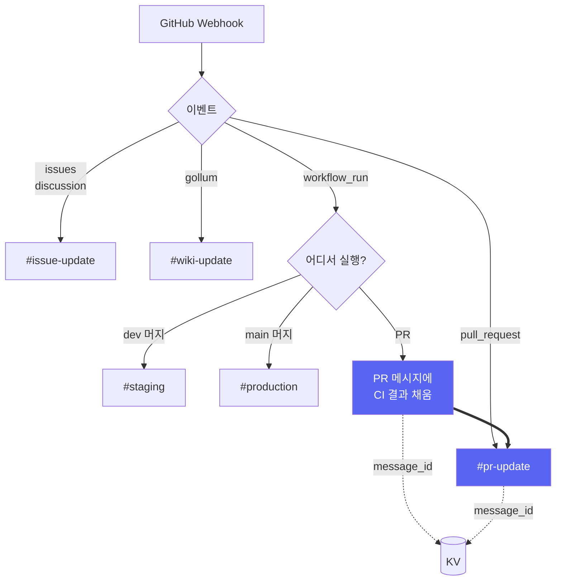
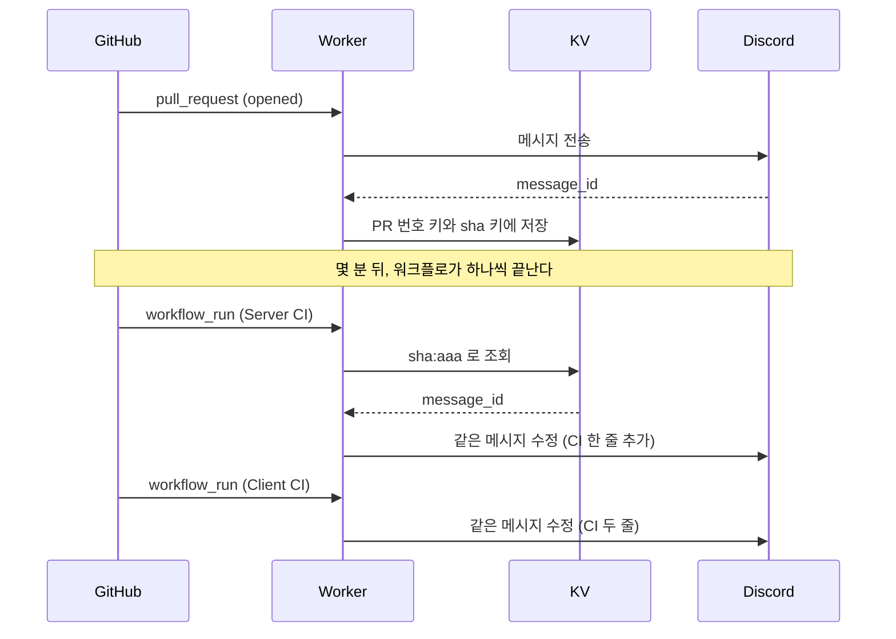

# Discord Worker

GitHub Webhook 이벤트를 이벤트별 Discord 채널로 전달하는 Cloudflare Worker입니다.
워크플로가 직접 보내는 알림도 `POST /notify` 로 함께 받습니다.



## GitHub Actions 설정

저장소 Secret에 아래 값을 등록합니다.

- `CLOUDFLARE_API_TOKEN`: Workers Scripts 편집 권한이 있는 Cloudflare API Token
- `CLOUDFLARE_ACCOUNT_ID`: Worker가 속한 Cloudflare Account ID

기존 Worker 이름이 `poudy-discord-worker`와 다르면 저장소 Variable
`CLOUDFLARE_WORKER_NAME`에 실제 이름을 등록합니다.

`infra/discord-worker/**`를 건드리는 Pull Request에서는 의존성 취약점 점검, 테스트,
정적 검사, Worker 번들 생성만 수행합니다.

**배포는 `dev`에 머지될 때 자동으로 이뤄집니다.** 같은 검사를 모두 통과한 뒤에만
배포 단계가 실행됩니다. 특정 시점의 코드를 다시 배포하려면 `Discord Worker Deploy`
워크플로를 수동 실행(`workflow_dispatch`)합니다.

## Cloudflare Worker Secret

아래 Secret은 Cloudflare Dashboard에 등록하며 GitHub Actions에 복사하지 않습니다.
Secret은 배포 후에도 유지되며, `keep_vars = true`로 Dashboard에서 등록한 일반
환경 변수도 유지합니다.

- `GITHUB_WEBHOOK_SECRET`
- `NOTIFY_TOKEN`
- `DISCORD_WEBHOOK_ISSUE_UPDATE`
- `DISCORD_WEBHOOK_PR_UPDATE`
- `DISCORD_WEBHOOK_STAGING`
- `DISCORD_WEBHOOK_PRODUCTION`
- `DISCORD_WEBHOOK_WIKI_UPDATE`

이 Worker는 **GitHub API를 호출하지 않습니다.** 알림에 필요한 값은 모두 웹훅
페이로드 안에 있으므로 GitHub 토큰이 필요하지 않습니다.

### PR 링크를 찾는 방법

`workflow_run` 페이로드는 PR 번호를 직접 주지 않습니다. 대신 GitHub이 만드는 머지
커밋 메시지에서 번호를 꺼냅니다.

```text
Merge pull request #22 from woowacourse-teams/feat/api-zod
                                      ← 빈 줄
feat : zod 스키마 생성 추가            ← 실제 PR 제목
```

첫 줄에서 번호를, 그 뒤 첫 문장에서 제목을 가져옵니다. 머지 커밋이 아니면
(예: `dev`에 직접 푸시) PR이 없으므로 커밋 제목만 싣습니다.

## KV 네임스페이스

PR 에서 도는 CI 는 별도 알림을 만들지 않고 **그 PR 알림 메시지에 CI 항목을 채워
넣습니다.** PR 이벤트와 `workflow_run` 은 서로 다른 웹훅으로 따로 도착하므로,
먼저 보낸 메시지의 `message_id` 를 기억해 두어야 나중에 찾아 고칠 수 있습니다.

이미 만들어 둔 네임스페이스를 `wrangler.toml` 에 연결해 두었습니다. 새로 만들려면
아래 명령을 쓰고 출력된 id 를 `kv_namespaces` 에 채웁니다.

```bash
npx wrangler kv namespace create WORKFLOW_RUNS
```



저장하는 키는 두 가지입니다. PR 번호로 찾는 키와, `workflow_run` 이 PR 번호를 주지
않으므로 `head_sha` 로 찾는 키를 함께 씁니다. 커밋을 푸시하면 `head_sha` 가 바뀌므로
`synchronize` 에서 새 sha 를 이어 두고, 이전 커밋의 CI 결과는 버립니다.
저장한 값은 3일 뒤 만료됩니다.

| 시점                  | 저장되는 키               | CI 결과   |
| --------------------- | ------------------------- | --------- |
| PR 열림 (sha `aaa`)   | `pr:...15`, `sha:aaa`     | 비어 있음 |
| CI 완료               | 그대로                    | 쌓임      |
| 커밋 푸시 (sha `bbb`) | `pr:...15`, **`sha:bbb`** | **버림**  |
| 새 커밋의 CI 완료     | 그대로                    | 새로 쌓임 |

바인딩이 없거나 저장된 PR 메시지를 찾지 못하면 그 워크플로만 따로 알립니다.
결과를 잃지는 않지만 PR 메시지에 모이지 않습니다.

### 동시에 끝나는 워크플로

KV에는 compare-and-swap이 없어 워크플로 두 개가 거의 동시에 끝나면 서로의 결과를
덮어쓸 수 있습니다. 쓰기 직전에 다시 읽어 그 사이 들어온 결과와 합쳐 대부분을
막지만, 두 요청이 같은 순간에 읽고 쓰면 결과 하나가 빠질 수 있습니다.
빠진 결과는 다음 워크플로가 끝날 때 다시 채워집니다.

완전히 막으려면 PR마다 Durable Object로 읽기와 쓰기를 직렬화해야 합니다.
실제로 결과가 빠지는 일이 잦아지면 그때 도입합니다.

## 워크플로가 직접 보내는 알림

GitHub Webhook 이 실어 오지 않는 소식은 워크플로가 `POST /notify` 로 보냅니다. 운영
SEO 측정처럼 GitHub 이 이벤트로 알려 주지 않는 값이 여기 해당합니다.

**보내는 쪽은 잰 값만 넘기고, 알림 모양은 Worker 가 정합니다.** 제목도 색도 본문도
`embeds/` 가 만듭니다. 보내는 쪽이 제목이나 색을 넘기는 자리는 두지 않았습니다.
그래야 알림이 늘어도 채널에 올라오는 모양이 한곳에 모입니다. Discord Webhook URL 도
Worker 만 알아서, 같은 URL 을 저장소 Secret 에 따로 둘 필요가 없습니다.

그래서 **알림 종류를 더하려면 이 Worker 를 고쳐야 합니다.** `notify.ts` 에 무엇을
받을지 스키마를 더하고, `embeds/` 에 그 값을 어떻게 보일지 씁니다. 워크플로만 고쳐서
새 알림을 만들 수는 없습니다.

인증은 `Authorization: Bearer` 헤더로 `NOTIFY_TOKEN` 을 확인합니다. GitHub Webhook 의
HMAC 서명과 자격을 나눠 두어, 하나가 새어도 다른 경로에 번지지 않습니다. 토큰 비교는
상수 시간으로 하여 앞자리가 몇 개 맞는지가 걸린 시간에 드러나지 않게 합니다.

```bash
curl --fail --silent --show-error \
  --header "Authorization: Bearer $NOTIFY_TOKEN" \
  --header 'Content-Type: application/json' \
  --data @notify-payload.json \
  "$WORKER_NOTIFY_URL"
```

보내는 쪽 저장소에는 아래 두 가지를 등록합니다.

| 이름                | 종류     | 값                                |
| ------------------- | -------- | --------------------------------- |
| `NOTIFY_TOKEN`      | Secret   | Cloudflare 에 등록한 것과 같은 값 |
| `WORKER_NOTIFY_URL` | Variable | 배포된 Worker 주소 + `/notify`    |

주소는 비밀이 아니라 Variable 로 둡니다. 토큰 없이는 401 이고, 로그에 값이 보여야
잘못된 주소로 쏠 때 바로 알아챕니다.

### 어느 알림에나 있는 자리

| 항목         | 필수 | 설명                                            |
| ------------ | ---- | ----------------------------------------------- |
| `kind`       | 예   | 알림 종류. 아래 표에서 고릅니다                 |
| `channel`    | 예   | 알림이 갈 채널 이름                             |
| `timestamp`  | 아니오 | 일어난 시각(ISO 8601). 없으면 받은 시각을 씁니다 |
| `repository` | 아니오 | 알림 아래에 남길 저장소 이름                    |

`channel` 은 아래 다섯 가지 중 하나이며 각각 같은 이름의 Secret 을 가리킵니다.

| `channel`    | 대상 Secret                    |
| ------------ | ------------------------------ |
| `issue`      | `DISCORD_WEBHOOK_ISSUE_UPDATE` |
| `pr`         | `DISCORD_WEBHOOK_PR_UPDATE`    |
| `staging`    | `DISCORD_WEBHOOK_STAGING`      |
| `production` | `DISCORD_WEBHOOK_PRODUCTION`   |
| `wiki`       | `DISCORD_WEBHOOK_WIKI_UPDATE`  |

### `kind` 별로 받는 값

| `kind`       | 무엇을 알리나      | 그리는 곳            |
| ------------ | ------------------ | -------------------- |
| `seo-report` | 운영 화면 SEO 측정 | `embeds/seo.ts`      |

`seo-report` 는 아래를 받습니다. `scores` 의 네 값은 0 부터 100 까지의 정수이며, 재지
못했으면 `null` 을 넣습니다. `runUrl` 은 없어도 됩니다.

```json
{
  "kind": "seo-report",
  "channel": "production",
  "siteUrl": "https://example.com",
  "indexable": false,
  "scores": {
    "performance": 87,
    "accessibility": 100,
    "bestPractices": 92,
    "seo": 64
  },
  "runUrl": "https://github.com/owner/repo/actions/runs/1",
  "repository": "owner/repo",
  "timestamp": "2026-09-08T01:02:03Z"
}
```

### 응답 코드

| 상황                               | 응답 |
| ---------------------------------- | ---- |
| 전송 성공                          | 200  |
| 토큰이 없거나 다름                 | 401  |
| JSON 또는 페이로드 형식 오류       | 400  |
| `NOTIFY_TOKEN` 미등록              | 500  |
| 대상 채널의 Discord Webhook 미등록 | 500  |

## GitHub Webhook 설정

GitHub 저장소의 `Settings > Webhooks > Add webhook`에서 아래와 같이 등록합니다.

- Payload URL: 배포된 Worker의 `workers.dev` URL
- Content type: `application/json`
- Secret: Cloudflare의 `GITHUB_WEBHOOK_SECRET`과 동일한 충분히 긴 임의 문자열
- SSL verification: 활성화

개별 이벤트 선택에서 아래 이벤트를 활성화합니다.

- Pull requests
- Pull request reviews
- Issues
- Issue comments
- Discussions
- Discussion comments
- Wiki
- Workflow runs
- Deployment statuses

등록 후 Webhook의 Recent Deliveries에서 응답 상태가 `200`인지 확인합니다.
다만 `200`이 Discord 전송 성공을 보장하지는 않습니다. 아래 "응답 코드"를 참고합니다.

## 채널 라우팅

| 이벤트                                             | 대상 Secret                                                   |
| -------------------------------------------------- | ------------------------------------------------------------- |
| `pull_request`, `pull_request_review`              | `DISCORD_WEBHOOK_PR_UPDATE`                                   |
| `issue_comment`                                    | PR에 달린 댓글이면 `..._PR_UPDATE`, 아니면 `..._ISSUE_UPDATE` |
| `issues`, `discussion`, `discussion_comment`       | `DISCORD_WEBHOOK_ISSUE_UPDATE`                                |
| `gollum`                                           | `DISCORD_WEBHOOK_WIKI_UPDATE`                                 |
| `workflow_run` (PR에서 실행)                       | `DISCORD_WEBHOOK_PR_UPDATE` (새 알림 대신 PR 메시지에 채움)   |
| `workflow_run` (머지 후 실행), `deployment_status` | 아래 기준에 따라 staging 또는 production                      |

**PR에서 도는 CI는 별도 알림을 만들지 않습니다.** 그 PR 알림 메시지에 CI 항목이
채워지므로 `#pr-update` 하나만 봐도 어느 PR의 결과인지 구분됩니다. 다만 메시지를
고치는 방식이라 Discord 알림은 울리지 않습니다.

deployment 채널에는 **`dev`나 `main`에 머지된 뒤 도는 워크플로**만 남습니다.
기준은 아래와 같습니다.

- `workflow_run`: `head_branch`를 기준으로 삼습니다. 알림 제목에는 워크플로 이름과 결과가
  들어가고, 본문에는 무엇이 이 실행을 유발했는지를 담습니다. 머지 커밋이면 커밋 메시지에서
  PR 제목과 번호를 꺼내 링크를 붙이고, 직접 푸시한 커밋이면 그 커밋 제목을 씁니다.
- `deployment_status`: `deployment.environment`를, 비어 있으면 `deployment.ref`를 기준으로 삼습니다.
  이 이벤트는 워크플로에 `environment:`를 선언하거나 Deployments API를 쓸 때만 발생합니다.

기준 이름은 대소문자를 구분하지 않으며 아래와 같이 판정합니다.

- `main`, `master` 또는 `production`·`prod`으로 시작 → `DISCORD_WEBHOOK_PRODUCTION`
- `staging`·`stage`·`dev`·`develop`·`development`로 시작 → `DISCORD_WEBHOOK_STAGING`

접두사는 이름 전체이거나 뒤에 `-`, `_`, `/`가 와야 합니다. 따라서 `prod-kr`은 production으로
가지만 `reproduction`이나 `devops`는 어느 쪽에도 해당하지 않아 알림을 보내지 않습니다.

어느 쪽에도 해당하지 않으면 알림을 보내지 않고 `200`으로 응답합니다. 이 저장소의 워크플로가
`dev`와 `main` 머지에서만 실행되기 때문에 문제가 되지 않습니다. 다른 브랜치에서도
돌리게 되면 그 브랜치 이름을 `deploymentWebhookKey`의 판정 규칙에 추가해야 합니다.

알림을 보내지 않는 액션도 있습니다. Draft 상태로 열린 PR, 승인이 아닌 리뷰,
`created`가 아닌 이슈 댓글, 봇이 작성한 댓글, 완료되지 않은 워크플로가 여기 해당하며
모두 `200`으로 응답하고 넘어갑니다.

## 응답 코드

GitHub Webhook은 2xx가 아닌 응답을 실패로 기록하고 재전송합니다. 그래서 이 Worker는
**재시도로 해결될 수 있는 실패에만 5xx를 반환**합니다.

| 상황                                                     | 응답 | 이유                                                      |
| -------------------------------------------------------- | ---- | --------------------------------------------------------- |
| 전송 성공                                                | 200  |                                                           |
| 알림 대상이 아닌 이벤트·액션                             | 200  | 무시한 것이므로 실패가 아닙니다.                          |
| Discord 레이트 리밋 (429)                                | 200  | 재전송해도 다시 429이며, 재시도가 한도를 더 밀어붙입니다. |
| Discord Webhook URL 형식 오류                            | 200  | 설정 오류라 재시도로 고쳐지지 않습니다.                   |
| Discord 5xx·네트워크 오류·타임아웃                       | 502  | 일시적 장애이므로 재시도할 가치가 있습니다.               |
| 서명 불일치                                              | 401  |                                                           |
| JSON 또는 페이로드 형식 오류                             | 400  |                                                           |
| `GITHUB_WEBHOOK_SECRET` 또는 대상 Discord Webhook 미등록 | 500  | 설정을 채우면 재시도가 성공합니다.                        |

레이트 리밋과 URL 형식 오류는 200을 반환하므로 **Recent Deliveries에는 성공으로 표시됩니다.**
이 두 경우는 아래처럼 Worker 로그로 확인합니다.

```bash
npx wrangler tail "${CLOUDFLARE_WORKER_NAME:-poudy-discord-worker}"
```

```text
Discord rate limited: DISCORD_WEBHOOK_PR_UPDATE 3.5
Invalid Discord webhook URL: DISCORD_WEBHOOK_ISSUE_UPDATE
```

레이트 리밋 로그의 마지막 숫자는 Discord가 `Retry-After` 헤더로 알려준 대기 시간(초)입니다.
자동 재시도는 하지 않습니다. Worker가 응답을 붙잡고 기다리면 GitHub Webhook의 전송 타임아웃에
걸리기 때문입니다. 이 로그가 자주 보이면 알림 대상 이벤트를 줄이거나 채널을 분리합니다.

`wrangler.toml`의 `[observability]`가 켜져 있어 Cloudflare Dashboard의 Workers 로그에서도
같은 내용을 확인할 수 있습니다.

## 로컬 검증

`infra/discord-worker`에서 아래 명령을 실행합니다. CI가 수행하는 검사와 같은 순서입니다.

```bash
pnpm install --frozen-lockfile
pnpm audit --prod
pnpm test
pnpm run check
pnpm run deploy:dry-run
```

`pnpm run check`는 타입 검사와 Biome 린트를 함께 실행합니다. 포매팅만 자동으로 고치려면
`pnpm run format`을 실행합니다.
